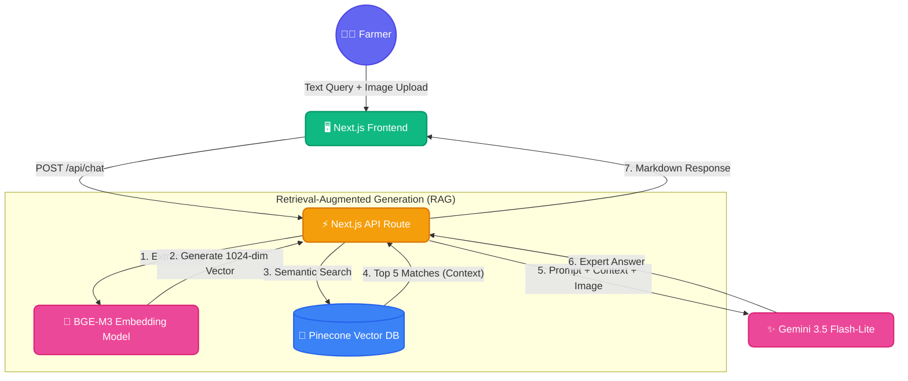

<div align="center">
  <h1>🌾 MahaKissanSeva</h1>
  <p><strong>Your AI Sugarcane Expert for Maharashtra</strong></p>
  <p>An intelligent, multimodal Retrieval-Augmented Generation (RAG) platform built to assist sugarcane farmers in Maharashtra with expert guidance on crop diseases, irrigation schedules, pesticides, and soil management.</p>
</div>

---

## 🌟 Overview

MahaKissanSeva acts as an always-online agricultural consultant. By combining the conversational and multimodal capabilities of **Google Gemini 3.5 Flash-Lite** with highly relevant context retrieved from **Pinecone**, this application provides accurate, grounded, and hyper-local advice.

Farmers can:
- Ask text-based questions in English (or Marathi).
- **Upload photos** of their diseased crops for instant visual diagnosis.
- Receive tailored advice backed by a dedicated knowledge base of Maharashtra sugarcane farming reports.

## 🏗 Architecture

The platform utilizes a modern serverless stack with a heavy emphasis on AI-driven data retrieval.



## ✨ Key Features

1. **Multimodal Diagnostics**: Upload a picture of a diseased sugarcane leaf, and the AI will diagnose the issue and provide actionable treatment steps.
2. **Local BGE-M3 Embeddings**: Instead of relying on expensive external APIs, the application runs the state-of-the-art `Xenova/bge-m3` embedding model locally via `@xenova/transformers` to convert queries into rich 1024-dimensional vectors.
3. **High-Fidelity RAG**: Queries are mapped against over 100 comprehensive markdown reports concerning Kolhapur, Pune, and general Maharashtra sugarcane farming practices.
4. **Premium UI/UX**: Built entirely without external component libraries, featuring custom CSS glassmorphism, floating particle animations, and seamless responsive design.

## 🛠 Tech Stack

- **Framework**: [Next.js 14](https://nextjs.org/) (App Router)
- **Styling**: Vanilla CSS (Custom tokens, animations, and gradients)
- **Generative AI**: [Google Gemini AI SDK](https://ai.google.dev/) (`gemini-3.5-flash-lite`)
- **Vector Database**: [Pinecone](https://www.pinecone.io/)
- **Embeddings**: HuggingFace `BAAI/bge-m3` via `@xenova/transformers`
- **Markdown Parsing**: `react-markdown` with `remark-gfm`

## 🚀 Getting Started

### 1. Prerequisites
- Node.js (v18+)
- A Google Gemini API Key
- A Pinecone API Key

### 2. Installation
Clone the repository and install dependencies:
```bash
git clone https://github.com/sudoantonkill/mahakissanseva.git
cd mahakissanseva
npm install
```

### 3. Environment Variables
Create a `.env.local` file in the root directory:
```env
GEMINI_API_KEY=your_gemini_api_key_here
PINECONE_API_KEY=your_pinecone_api_key_here
PINECONE_INDEX_NAME=sugarcane-rag
```

### 4. Vector Database Ingestion
Before running the app, you need to populate your Pinecone index with the knowledge base. Ensure your Pinecone index is created with **1024 dimensions** and the cosine metric.

Run the background ingestion script:
```bash
node scripts/ingest.mjs
```
*(This will read all 101 markdown files in the `data/` directory, chunk them, embed them using BGE-M3, and upsert them to Pinecone).*

### 5. Running the Application
We've provided custom bash scripts to easily manage the local development server in the background:

**To Start:**
```bash
./start.sh
```
The application will be available at `http://localhost:3000`. Logs are piped to `server.log`.

**To Stop:**
```bash
./stop.sh
```
*(Safely shuts down the background process and cleans up any orphaned ports).*

---
<div align="center">
  <p><i>Empowering the backbone of India with Artificial Intelligence.</i></p>
</div>
